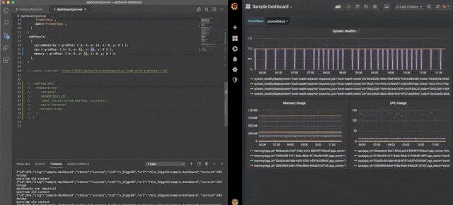

automatically uploads the generated Grafana json after file changes

## Usage

`reloader.sh -t http://localhost:3000 -t 'http://localhost:3000' -u grafana-user -p grafana-pass -- jsonnet -J grafonnet dashboard.jsonnet`

## Install
clone the repo and run `./build.sh`

### Dependencies

- go
- jq
- fswatch

install dependencies on mac:
`brew install go jq fswatch`
